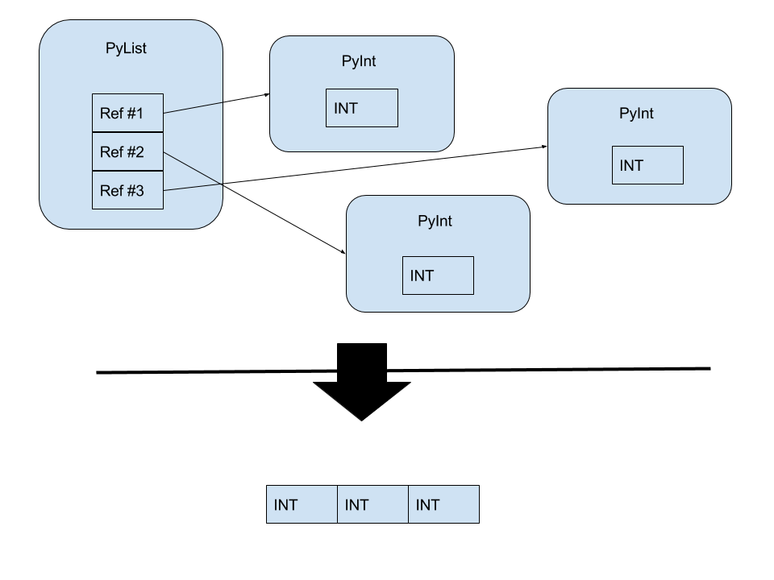
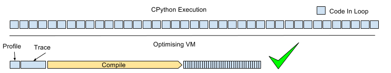
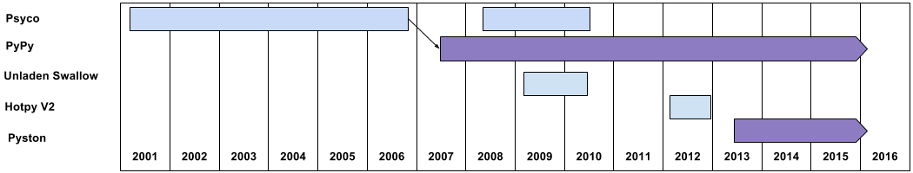
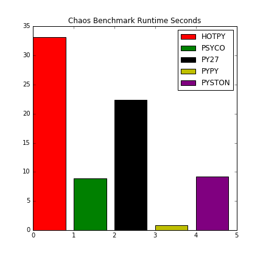
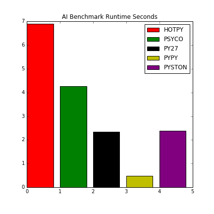
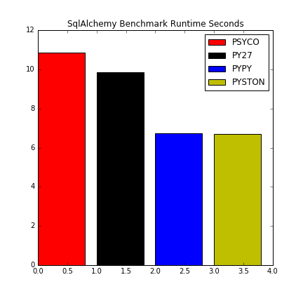
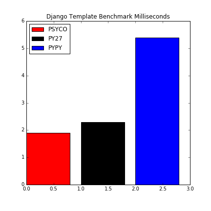
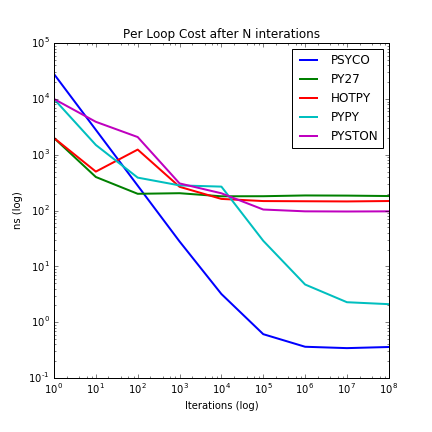
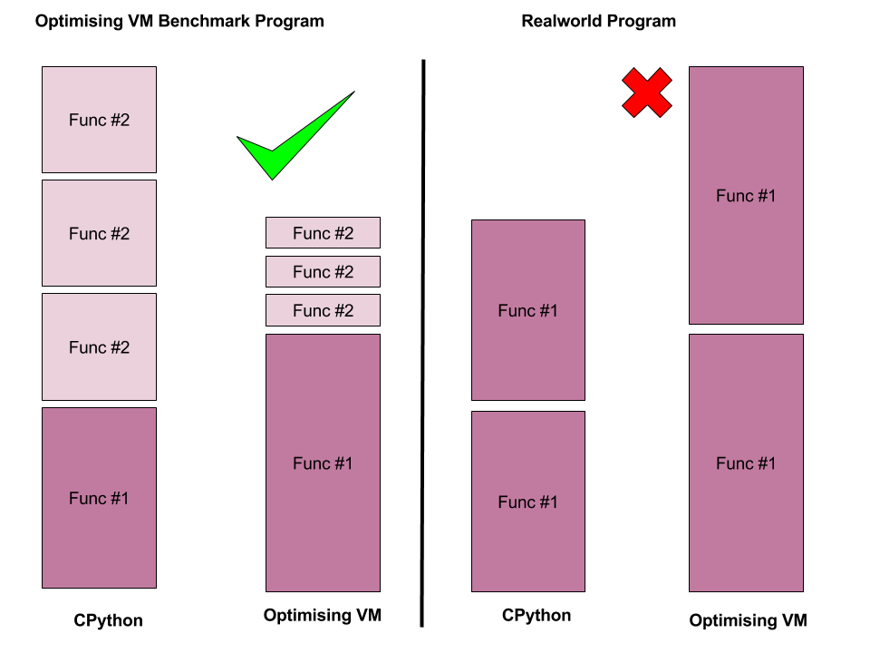

:title: On Being Obsessed With Python Runtime Optimisation
:data-transition-duration: 300

On Being Obsessed With Python Runtime Optimisation
==================================================

Tony Simpson
------------

@agjasimpson

github.com/tonysimpson

----

What I'm Not Covering
=====================

.. note::
	* Things that compile Python code before Runtime:
		* Without type hints because they are to stupid to talk about
		* With type hints (like Cython) because they require you to rewrite your code
	* Things that allow you to easily embed non-Python code

	I will talk about Python subset runtime compilers like Numba but only 
	briefly

----

Terms
=====

	* CPython
	* Compile
	* Optimise

.. note::
	* CPython: The normal Python implementation written in C hence CPython to distinguish it from other implementations. It's what you get if you download Python from python.org
	* Compile: Taking some instructions or data and converting them into a (usualy) more efficient form.
	* Optimise: I most cases this will refere to some form of compilation

----

Numba
=====

.. code:: python

	@jit
	def create_fractal(min_x, max_x, min_y, max_y, image, iters):
		height = image.shape[0]
		width = image.shape[1]

		pixel_size_x = (max_x - min_x) / width
		pixel_size_y = (max_y - min_y) / height
		for x in range(width):
			real = min_x + x * pixel_size_x
			for y in range(height):
				imag = min_y + y * pixel_size_y
				color = mandel(real, imag, iters)
				image[y, x] = color

		return image

.. note::
	* Plugin Compiler for CPython
	* Allows you to mark up some funtion as Compilable
	* Uses runtime information to compile a subset of Python to VERY fast code
	* Concentrated on numerical and scientific computing uses
	* It does vectorisation and plays nice with numpy

----

Why I Think General Purpose Python Runtime Optimisers Are Awesome
=================================================================

.. note::
	* Not because Python "is slow"

		Python is about 100X slower that C
		If I ask you to multifply two large numbers and print the result it
		would take you say 1 second - C can do that 10 million times a second.
		You're about 10 Million X slower than C - but that misses the point.

	* It's a complicated challenge 
	* You get to play with assembly language
	* Being fast isn't always important but it is always cool
	
----

Where  Are They Very Useful
---------------------------

.. note::
	* Domains where you want to prototype new algorythems in Python but performance is important
	* If you're running a lot of Python in production and are limited by hardware budgets

----

Examples Of Optimisation Techniques
===================================

.. note::
	I'm going to descibe two breifly to give you an idea of what we're talking about.

----

Runtime Type Specialisation
===========================

.. note::
	Types are normally stored in structures that make it easy to manipulate them in a generic why.

	The optimiser converts them into a more efficient form but it now needs to make sure that code interacting with them treats them in a specific mannor.

	This allows significantly better performance due to fewer operations on memory and the use of more efficient instructions which can operate on more than one item of data at once.

	It can also hurt performance if the data needs to be frequently converted between it special and general form.

    
----

Runtime Code Compilation
========================

----

Implementations
================

-----

Psyco
=====

.. note::
	* Python Module
	* Armin Rigo Phd project
	* started in 2001
	* Py2.2 - Py2.7 - 32bit arch only
	* Code was complicated and difficult to maintain against multiple python versions, just to 64 bit architectures was too much and Armin moved on to other things
	

---- 

Unladen Swallow
===============

    
.. note::
	* Google sponsored attempt, two fulltime devs, aimed at making Python 2x faster - Finally Google will solve everything
	* Failed 15% slower
	* Didn't do enough to speicallise the code - spent a lot of dev effort improving LLVM
	* Google many engineers do you have working on your next failed attempt to compete with facebook? Thanks Google

----

HotPy V2
========

    
.. note::
	* Mark Shannon
	* Attempted to a pragmatic and maintainable JIT integrated with CPython
	* Lots of interesting ideas about how to optimise Python without breaking code

----

PyPy
====

.. note::
	* Completely seperate Python Implementation
	* Spawned from Psyco by Armin and others as an attempt to overcome the limitations of that approach
	* latest py2.7 and py3.2
	* doesn't fully support c extensions or C API - promotes alternative approach based on cffi
	* fantatic performance on it's benchmarks vs CPython - sometime > 140%
	* Uses moving GC instead of Ref Counting 
	
----

Pyston
======

.. note::
	* Developed at Dropbox by 2 full-time developers
	* Optimizing VM Targeting Python 2.7
	* Borrows a lot of code from CPython
	* Aims to fully support the C API and existing C extensions
	* Currently in early alpha but running some large code bases
	* Last release Nov. 2015 
	* Next release is expected to be able to run Dropbox production code 
	* Uses a multiphase optimisation approach
		* hot traces are compiled to hand written specialised versions for each Python Bytecode
		* for very hot code a more capable LLVM is invoked.
	* https://gist.github.com/synapticarbors/167777b22b006f90cc5f

----

Benchmarks
==========

.. note::
	Not about which is better, that is a very difficult question to answer, just here to illistrate some points
	
----

Benchmarks
==========

----

Benchmarks
==========

----

Benchmarks
==========

----

Benchmarks
==========

----

Benchmarks
==========

----

PyPy Performance
================

CPython 2.7 

.. code::

	** Binary append **

	[  20KB ] write one unit at a time...                   2.7 MB/s
	[ 400KB ] write 20 units at a time...                  51.7 MB/s
	[ 400KB ] write 4096 units at a time...                4486 MB/s
	[  10MB ] write 1e6 units at a time...                 9620 MB/s
	
PyPy 2.7

.. code::

	** Binary append **

	[  20KB ] write one unit at a time...                  13.2 MB/s
	[ 400KB ] write 20 units at a time...                   299 MB/s
	[ 400KB ] write 4096 units at a time...                5141 MB/s
	[  10MB ] write 1e6 units at a time...                 5600 MB/s	

.. note::
	* There are cases where PyPy is slower than CPython
	* Here the small writes are faster in PyPy, probably because the 
	  loop gets optimised but large writes are slower maybe because the 
	  libraries aren't as well optimised as the code in CPython

----

Benchmarks
==========

----

More PyPy
=========

Creating a JIT is a complex balancing act:

* Running Compiled Code / Time Spent Compiling
* Optimisations / Compatibility
* Mature Code / New Ideas 

.. note::
	PyPy is the only game in town at the moment but getting an idea of real 
	world performance is difficult - internet sources suggest between 30% 
	faster and 50% slower than CPython on Django and other large code bases.

	Why might PyPy and other JITs end up slowing things down

----

The Benchmarks Problem - Hidden Performance Regressions
=======================================================

----

How To Create A JIT Which Is Real-World Fast
============================================

* Instrument youre JIT to measure performance at every optimisation point
* Run large real world applications like Django, Plone, Reddit(?)
* Base progress on analysis

.. note::
	Base your progress on analysis of what your JIT makes faster/slower and how commen these things are in real code.
	Better understanding of what is happending will lead to a better performing JIT.

----

Psyco Revisited
===============

Bring back Psyco!

.. note::
	PyPy not supporting most important C extensions is too much of a draw back for me.
	Pyston is heading in the right direction but it has a long way to go and still could fail like Unladen Swallow.
	I have a plan

----

Questions
=========

